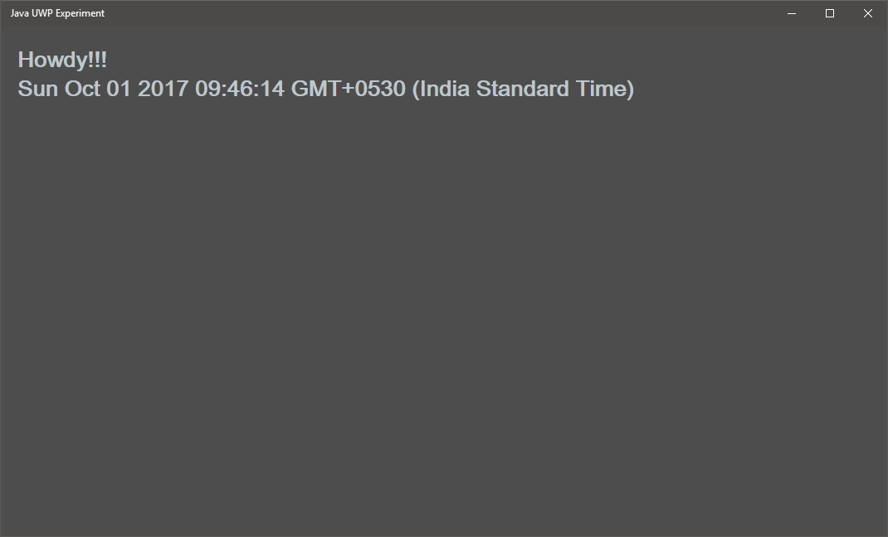

# Java UWP Experiment

An attempt to enable UWP (Universal Windows Platform) apps using Java by using GWT (Google Web Toolkit). The procedure is as follows:

  - You write your application using Java
  - It's transpiled to JavaScript using GWT
  - VS solution will be updated with new sources
  - Clean and Rebuild the solution in VS
  - Run the UWP app in local machine or in Simulator.

The finished program will look like this.

The procedure is to first create a UWP solution using Visual Studio 2017 and then add Java sources and the build script written in Gradle. Instructions will be written as a blog post and will be linked here soon.
